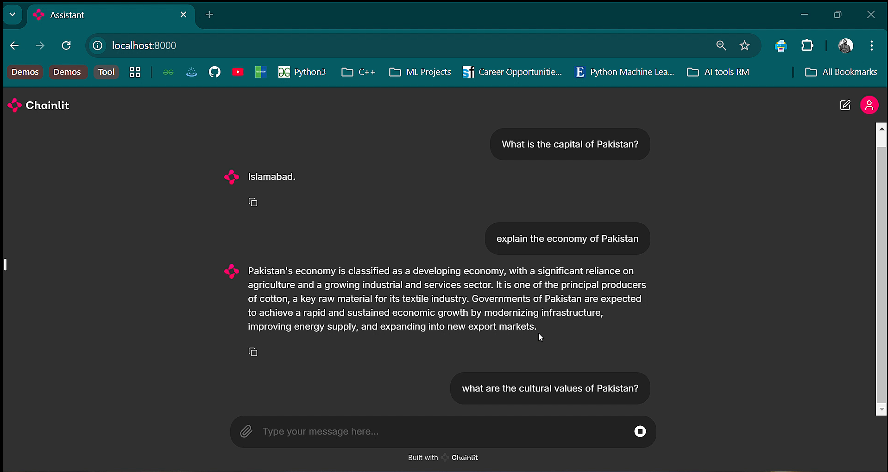

# RAG-based Chatbot for Pakistan Data

## Overview
This project implements a **Retrieval-Augmented Generation (RAG)** chatbot using custom data related to Pakistan’s history, economy, geography, economy, and culture. Langchain and Chainlit were used to design the chatbot architecture and deploy it with real-time updates.

## Key Features
- **Retrieval-Augmented Generation (RAG)**: Combines a retrieval-based mechanism with a generative language model.
- **Custom Data**: Includes information about Pakistan’s history, geography, economy, and culture.
- **Real-Time Responses**: Provides accurate and context-aware answers based on the latest data.

## Technologies Used
- Python
- Langchain, Chainlit
- PyTorch, Transformers
- Hugging Face Models

## Dataset
The dataset is custom and covers Pakistan's history, geography, political economy, culture, tourism, education, and sports. It is stored in the `data.zip`.

## Results
- **Performance**: The chatbot provides real-time responses with high accuracy and efficiency.
- **Sample Conversations**:
  - 

## File Descriptions
- **`LLM_RAG_Model.py`**: Main script for deploying the RAG-based chatbot.
- **`gui.py`**: Script to run gui.
- **`data/`**: Contains subfolders for Pakistan-specific data (history, geography, etc.).

### 1. Clone the Repository
```bash
git clone https://github.com/yourusername/RAG-Chatbot-Pakistan.git
cd RAG-Chatbot-Pakistan
